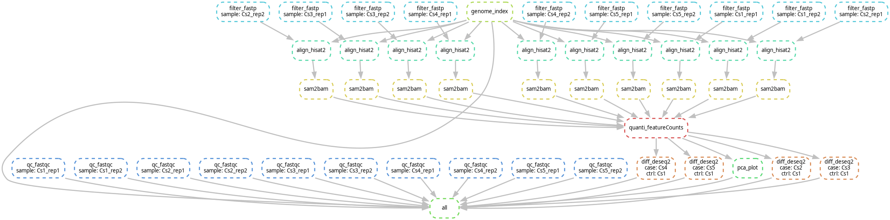

# Environment
- 📮 System=Ubuntu 22.04.5 LTS
- 📦 Snakemake=7.32.3
- 📌 Singularity=3.11.4
- 🎆 Python=3.13.5
- 🎉 R=4.4.3
***
# Description
* This is a bulkRNA-seq pipeline base on [snakemake](https://snakemake.readthedocs.io/en/stable/) workflow that able to complete primary analysis.
* [Singularity](https://sylabs.io/singularity/) is supported in this pipeline.
* If you use pipeline in your paper don't forget citing the URL of this repository,thanks!<br>
# Graph of jobs

# Preparation
## Clone
```shell
git clone https://github.com/BioinfoCSM/BulkRNA_pipeline.git
cd BulkRNA_pipeline
#Tips:you need to set current directory to work_dir when change parameters in subsequent step!
```
## Deployment
```shell
#copy your reference genome fasta and gtf annotation file to BulkRNA_pipeline/ref and rename genome.fa/genes.gtf separately
mkdir ref
cp path/your_reference.fa ref/genome.fa
cp path/your_annotation.gtf ref/genes.gtf
#pull a singularity container to BulkRNA_pipeline/image
mkdir image
cd image
singularity pull --arch amd64 library://bioinfocsm/share/bulkrna:v1.0
or
singularity pull --arch amd64 library://bioinfocsm/share/bulkrna:sha256.5d3b05d0f6021dacea1d5bd2a411f5c411466feb36fb7a6ff8bed0a2800c6d43
cd ../
#replace example rawdata/sample_name.fastq.gz with your project`s fastq file
rm rawdata/*
cp path/your_fastq.fastq.gz rawdata/
#get samples.txt and contrasts.txt
samples.txt:group_name\tsample_name
contrasts.txt:case_name\tcontrol_name
#Tips:\t represent tab separate
```
# Usage
## Change parameter
`vi main.sh`
* Firstly:set the total core for this pipeline
* Secondly:change script/config.py command-line argument according your project requirement,write and quit.view help document by `singularity exec image/BulkRNA.sif python script/config.py -h`
## Check the pipeline by dry run
```shell
snakemake --dry-run -s Snakefile
```
## Run the main program
```shell
nohup sh main.sh 1>main.log 2>&1 &
```
## Check the log file when tasks completed
```shell
cat main.log
#Tips:you can see the information similar to the following after all of tasks completed
```
```shell
start at Fri Jun 27 16:48:24 CST 2025
config file completed!
check your file and running snakemake!
complete at Fri Jun 27 16:49:00 CST 2025
```
***
# Info
* Author:BioinfoCSM(SiMing Cheng)
* Email:simoncheng158@gmail.com


